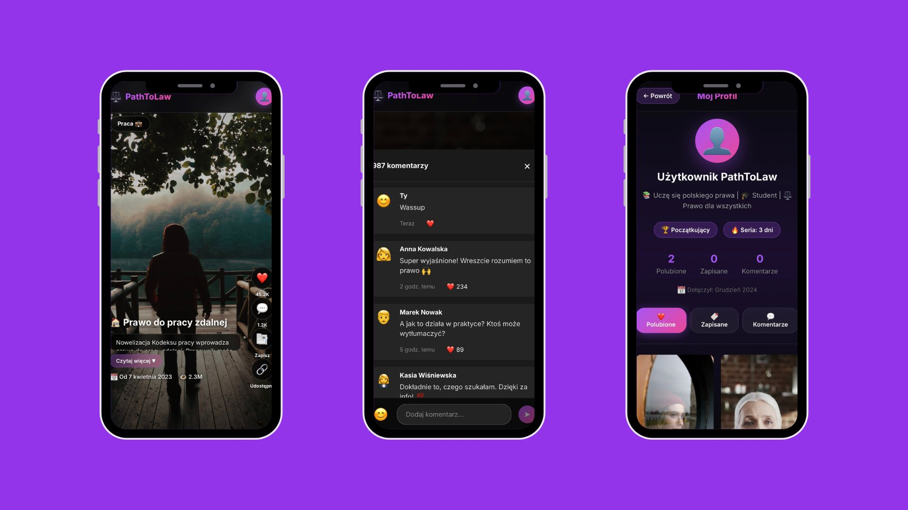

# ⚖️ PathToLaw

**Polskie prawo na TikTok** - Discover and understand Polish law through an engaging, vertical video feed.

[🚀 **View Live Demo**](https://pathtolaw.vercel.app/)



## 🌟 Overview

**PathToLaw** revolutionizes legal education by combining the addictive engagement of TikTok-style vertical scrolling with crucial legal knowledge. Users can swipe through laws, understand complex regulations via short explanations, and engage with the community.

Built with a futuristic, glassmorphism-inspired UI, it makes learning about your rights and obligations not just educational, but visually stunning.

## ✨ Key Features

- **📱 Vertical Video Field**: Snap-scroll through legal topics just like your favorite social media apps.
- **🎥 Immersive Experience**: Full-screen video backgrounds that bring legal contexts to life.
- **🎓 Bite-sized Knowledge**: Complex laws broken down into simple, digestible summaries.
- **💬 Interactive Community**: Discuss, ask questions, and share insights in the comment section.
- **🌑 Premium UI**: Dark mode aesthetic with neon accents and glassmorphism effects.
- **⚡ Mobile First**: Optimized for seamless performance on all mobile devices.

## 🖼️ Gallery

<div style="display: flex; gap: 20px;">
  
  
</div>

## 🛠️ Tech Stack

- **React 19**: Powered by the latest React features.
- **Vite**: Lightning-fast build tool and dev server.
- **Framer Motion**: Smooth, physics-based animations for swipes and interactions.
- **Vanilla CSS**: Custom-crafted variables and responsive designs (Mobile-first).

## 🚀 Getting Started

1.  **Clone the repository**
    ```bash
    git clone https://github.com/hacknation/pathtolaw.git
    cd pathtolaw
    ```

2.  **Install dependencies**
    ```bash
    npm install
    ```

3.  **Run the development server**
    ```bash
    npm run dev
    ```

4.  **Open in browser**
    Navigate to `http://localhost:5173` to see the app in action!

## 🤝 Contributing

Contributions are welcome! Please feel free to submit a Pull Request.

---

*© 2025 PathToLaw. Making law accessible for everyone.*
